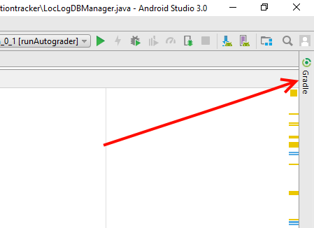
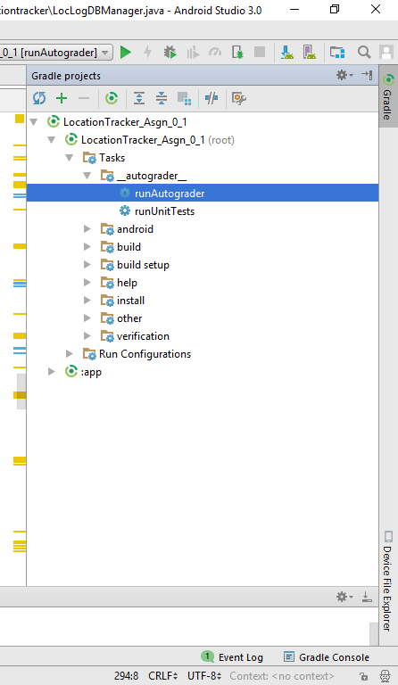
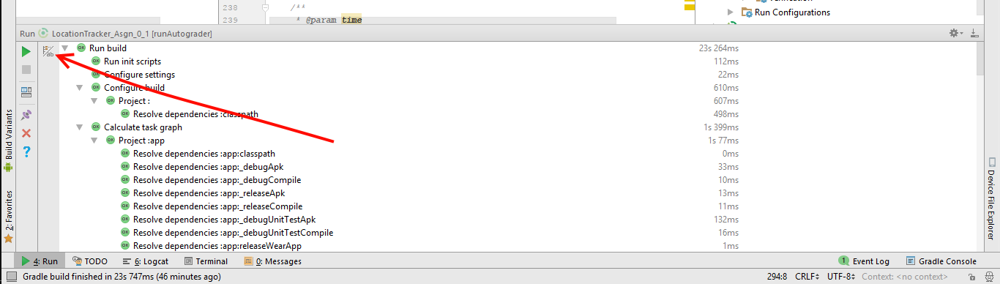
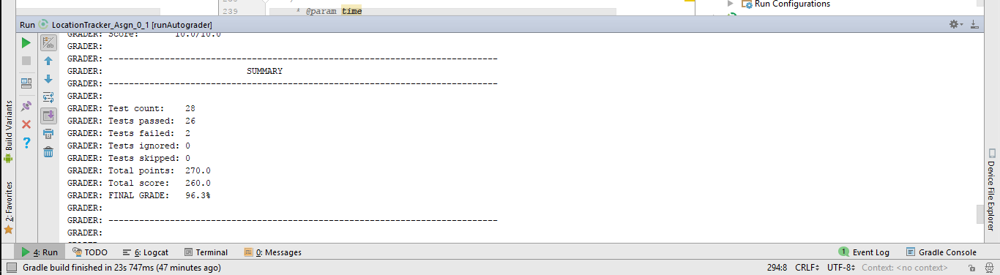

# Assignment 1

## Overview

This assignment will focus on your ability to implement an Android application using test driven development methods. 

## Warning

UNDER NO CIRCUMSTANCES SHOULD YOU USE THIS APP "AS IS" IN PRODUCTION!!!

## Instructions

First clone this Git Repository and import it into Android Studio, and make sure to sync the gradle project to download all required dependencies. 

This assignment tests your ability to correctly implement an Android application using well defined tests as a requirements guide. 

We have provided the foundation of an application that implements a location tracking service. We have also provided two test files that define the behavior of a correct implementation (a correctly implemented service should pass 100% of the test methods in each of these files). Your task is to complete the location tracking service so that it passes each of these test files. 

You will need to be familiar with [Android Services](https://developer.android.com/guide/components/services.html) as well as [Android's SQLite database API](https://developer.android.com/training/basics/data-storage/databases.html) to successfully complete this assignment. 

### Code to complete

Out of the classes we have provided (each described below), there are only a few places you will need to write code for this assignment. Each place where you should complete the given implementation is represented by a TODO statement in the code, and are: 

- **LocationLogService**:
	- *onStartCommand()*: You will perform any start up actions, gather the required data to store, and store said data in the database using the LocLogDBManger methods that you write. 

- **LocLogDBManager**:
	- *storeLocationData()*: Store the given data in the database
	- *deleteEntries()*: Delete all entries that match the given data. Passing 'null' for one of the parameters should delete any values for that parameter.
	- *queryEntries()*: Query for all entries matching the passed parameters. Returns a Cursor over the queried entries. 

You are free to write any helper methods or classes you wish, but **do not change the methods** we have provided outside of the TODO sections. 

## Provided Code

### Application Code:

You will be completing an application that stores the device's location and a description provided by the user in a database. The database will be accessed via a service which is available to other applications. It consists of the following classes (classes with asterisks have TODO statements for you to complete):

- **UIActivity.java**: This class acts as a simple user interface to demonstrate how the service might be used. It has a single EditText element that allows the user to enter a text description. When the user clicks the 'Log Location' button, it stores the description in an intent and uses said intent to start the LocationLogService. This activity also makes sure to request the ACCESS_FINE_LOCATION permission if it is not granted before starting the service.

- **LocationLogService.java** *: This is a started service that stores the devices location (as Latitude and Longitude), the current time, and a passed description String in a database. It is exported, meaning that any application with knowledge of its API can access it, rather than just the UIActivity described above. The OnStartCommand(), which is called when some process attempts to start the service, needs to be implemented to store the necessary data. This method is passed an intent which will contain the description String that should be stored.

- **LocLogDBManager.java** *: This class interfaces with the underlying SQLite database that will be storing the location data. It has various interface methods that store, query for, and delete database entries that must be implemented. Please note that the getSQLite() public method is only for testing purposes, and that in a production app you normally shouldn't expose a database in this way. 

- **LocDBSQLHelper.java** : This is a convenience class that makes creating and gaining access to the properly initialized SQLite database easier. 

- **LocDBContract.java**: This Contract defines all of the constant identifiers for the SQLite database, specifically the column names. These Constants are used to access the specific columns, and should be referenced when interacting with the database in the LocLogDBManager. 

### Testing 

There are two test files that need to be passed successfully by your implementation. You should read and understand each test, as they define the requirements for the application. The Rubric annotation above each test method describes what each method is testing for, and how many points it is worth. 

- **DBTest.java**: (in 'app\src\test\java\extensibleapps\vandy\mooc\locationtracker' directory) This file is focused on testing your LocLocDBManger class. It will make sure that each of your interface methods works as expected, and that the manager is interfacing with the SQLite db appropriately. 

- **LocationLogServiceTest.java**: (in 'app\src\androidTest\java\extensibleapps\vandy\mooc\locationtracker' directory) This file focuses on the LocLogService itself. It ensures that the service starts and handles location storage requests correctly. 

## Testing Your Implementation

We are using a new, in development AutoGrading framework for this assignment. The rubrics you see above each test method are part of this framework. This framework uses Gradle to check your implementation. 

To run individual test files to check your current progress, you can run the 'runUnitTests' and 'runInstermentationTests' Gradle tasks. These tasks are available in your Gradle projects tab in android studio, in the ':app/Tasks/_autograder_' folder. 

To get to these tasks, first open the Gradle projects tab: 

And naviate to the ':app/Tasks/_autograder_' directory, and double click to run the desired task:

Running these tasks will run the tests and show you their output, as well as give you information contained in the Rubric. The 'runUnitTests' runs the database test file, while 'runInstermentationTests' tests the service. 

When you run the tests, you will see output similar to this at the bottom of your screen: 

To see the detailed output including rubric information and test results, press the 'Toggle tasks executions/text mode' button (pointed to by the red arrow). This will switch to a view like the one shown below, with detailed output. 

**Note:** make sure that you have an Android Virtual Device running and connected before running Instermentaiton Tests, as they will need to connect to and run the project on this device for testing. 

## Submitting Your Assignment

Our Grading backend is still in development, so for now you can view the results of your testing in the generated submission directory after running the autograder. Once the backend is complete, you will be able to recieve an offical grade. 
